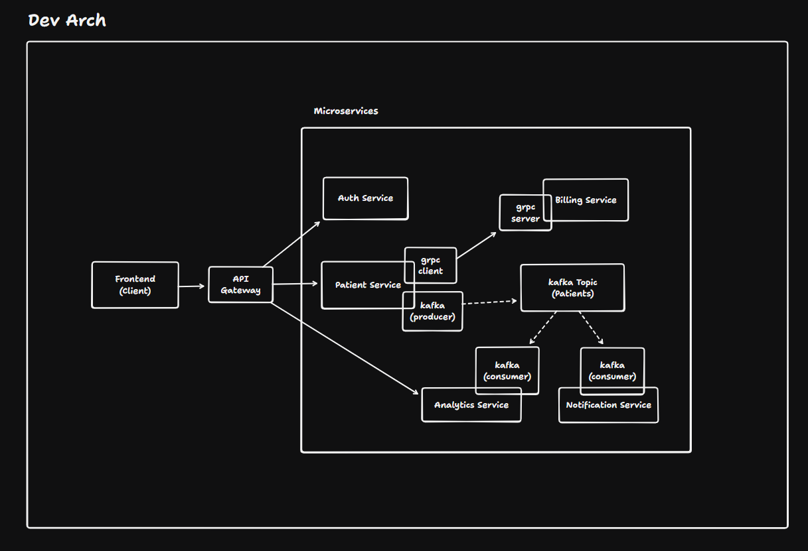
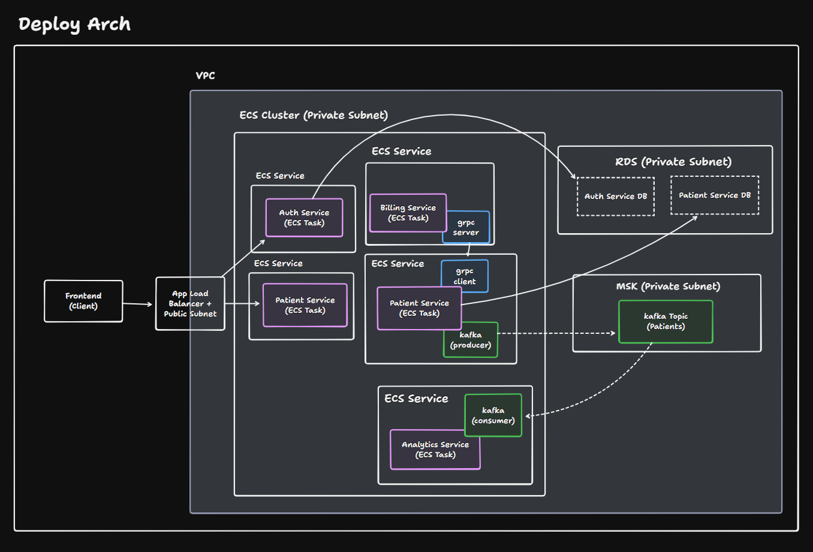

# Microservices with Java

Re-engineering microservices with VSCode setup (cos it was build on IntelijIDEA at first)

## Architecture



## VSCode Setup

Requirement (Extensions):
- Spring Boot Extension Pack. 
- Java Extension Pack.

### Start Comamnd
Command : 

`Spring initialzr : Create a (maven/gradle/etc) project` 

Then setup :

- springboot version
- group
- artifact
- package name
- depedencies

## How to Run :
Requirements :
- Localstack
- Docker Desktop
- AWS cli

- LocalStack
Create localstack account and get personal auth token

Configure localstack with auth token, leave other settings to default 

- Install AWS CLI

Configure aws with :
```
aws configure
```

- Create Docker Image 
With docker compose and Makefile command

- Run Localstack :
```
./infrastructure/localstack-deploy.sh
```


Domain should be shown in command:

```
aws --endpoint-url=http://localhost:4566 elbv2 describe-load-balancers \
    --query "LoadBalancers[0].DNSName" --output text
```


### Run Command 
Makefile in each services, Some options :
- make clean
- make build
- make up
- make down


## Error Handling

If encounter any error in running script, maybe because depedencies issue :
```
aws --endpoint-url=http://localhost:4566 cloudformation describe-stack-events --stack-name patient-management --output table
```

Check error on log table

### To Do (?)
Currently hard_coded properties, so there will be .env.example  


